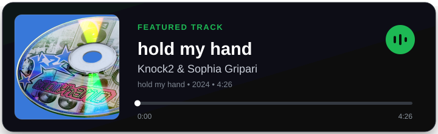
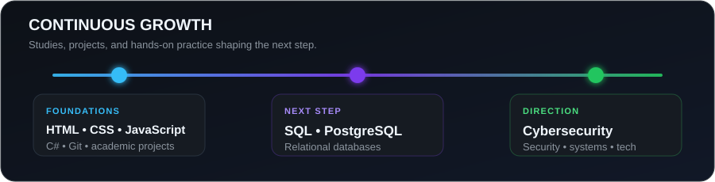

  
  

  

    
    
  

## 👨‍💻 About Me

I am a **Systems Analysis and Development** student and an aspiring software developer. I use academic and personal projects to turn theory into practice, document my progress, and strengthen my foundations in front-end, back-end, and programming logic.

- 🚀 Growing my web development skills with HTML, CSS, and JavaScript.
- 🧠 Practicing programming logic, object-oriented programming, and console applications with C#.
- 🗄️ Building a foundation in relational databases with SQL and PostgreSQL.
- 🧩 I enjoy organizing ideas and turning them into functional experiences.
- 🛡️ My long-term professional goal is to work in cybersecurity.

I build academic and personal projects with **HTML, CSS, JavaScript, C#, and .NET**, applying programming logic, object-oriented programming, DOM manipulation, CRUD operations, authentication, role-based access, LocalStorage, Bootstrap, Git, and GitHub. I am currently expanding my knowledge of relational databases with **SQL and PostgreSQL**.

 

## 🛠️ Technologies and Tools

  
  
  
  
  
  
  
  
  
  
  
  

## 🎧 Featured Track

  

## 🌟 Featured Projects

| Project | Highlights |
| --- | --- |
| [**Planeja Lar**](https://github.com/marxz37/planeja-lar-controle-financeiro) | Household financial planning app with a dashboard, goals, cards, and reports. |
| [**TechEvents**](https://github.com/marxz37/techevents) | IT events and certifications catalog with favorites, demo authentication, and CRUD operations. |
| [**Destinations and Attractions Guide**](https://github.com/marxz37/guia-destinos-atracoes) | Responsive guide built with Bootstrap, dynamic rendering, and data-driven pages. |
| [**Employee Management System**](https://github.com/marxz37/cadastro-funcionarios-controle-acesso) | Academic system featuring CRUD operations, role-based access, and LocalStorage persistence. |
| [**First Website — Neymar**](https://github.com/marxz37/primeiro-site-neymar) | My first academic website, created to practice structure, navigation, HTML, and CSS. |

## 📊 My GitHub Journey

  

## 📈 GitHub Stats

  
  

---

  Each repository captures a step in my journey through technology and cybersecurity.

