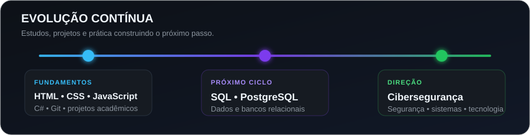

  

    
  

  

  

    
    
  

## 👨‍💻 Sobre mim

Sou estudante de **Análise e Desenvolvimento de Sistemas** e desenvolvedor em formação. Uso projetos acadêmicos e pessoais para transformar teoria em prática, registrar minha evolução e fortalecer os fundamentos de front-end, back-end e lógica de programação.

- 🚀 Evoluindo em desenvolvimento web com HTML, CSS e JavaScript.
- 🧠 Praticando lógica, orientação a objetos e aplicações de console com C#.
- 🧩 Gosto de organizar ideias e transformá-las em experiências funcionais.
- 🛡️ Meu objetivo profissional é atuar futuramente na área de cibersegurança.

 

## 🛠️ Tecnologias e ferramentas

  
  
  
  
  
  
  
  
  
  
  

## 🎧 Música em destaque

  

## 🌟 Projetos em destaque

| Projeto | O que você encontra |
| --- | --- |
| [**Planeja Lar**](https://github.com/marxz37/planeja-lar-controle-financeiro) | Aplicação de planejamento financeiro familiar com dashboard, metas, cartões e relatórios. |
| [**TechEvents**](https://github.com/marxz37/techevents) | Catálogo de eventos e certificações de TI com favoritos, autenticação demonstrativa e CRUD. |
| [**Guia de Destinos e Atrações**](https://github.com/marxz37/guia-destinos-atracoes) | Guia responsivo com Bootstrap, renderização dinâmica e páginas orientadas por dados. |
| [**Cadastro de Funcionários**](https://github.com/marxz37/cadastro-funcionarios-controle-acesso) | Sistema acadêmico com CRUD, perfis de acesso e persistência no LocalStorage. |
| [**Primeiro Site — Neymar**](https://github.com/marxz37/primeiro-site-neymar) | Meu primeiro site acadêmico, criado para praticar estrutura, navegação, HTML e CSS. |

## 📊 Minha evolução no GitHub

  

---

  Cada repositório registra uma etapa da minha jornada em tecnologia e cibersegurança.

